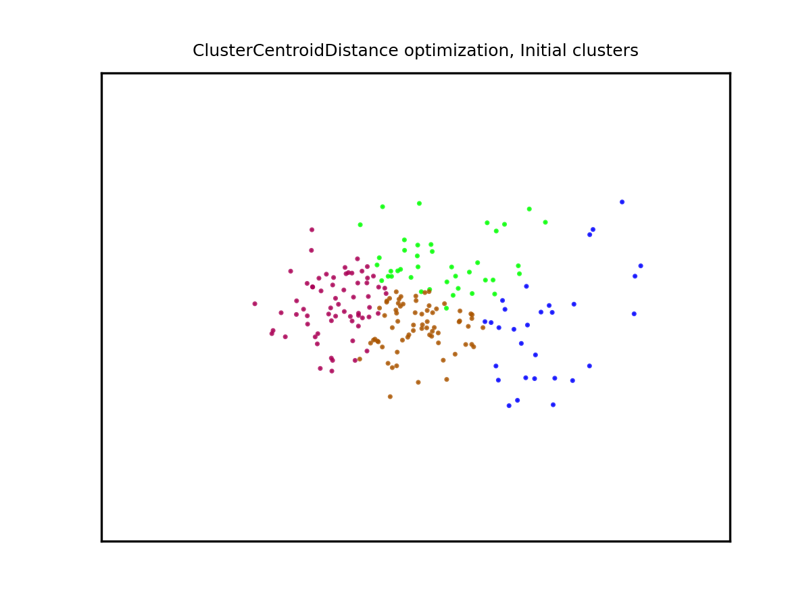
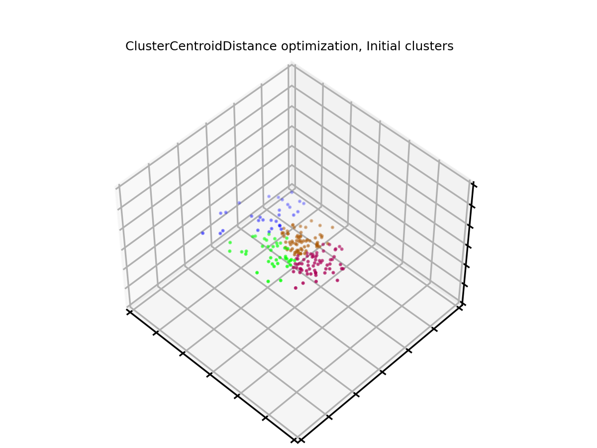
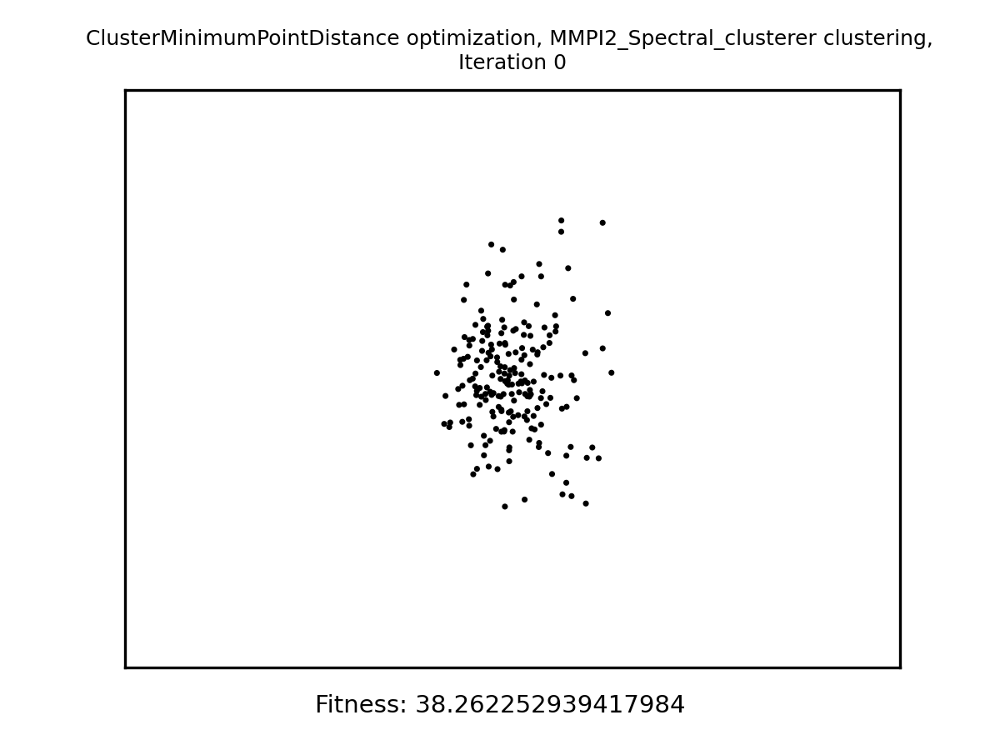
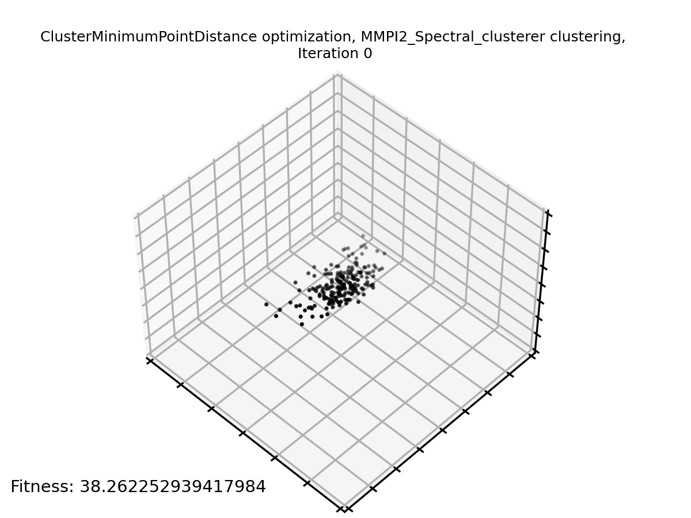
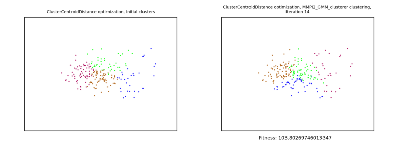
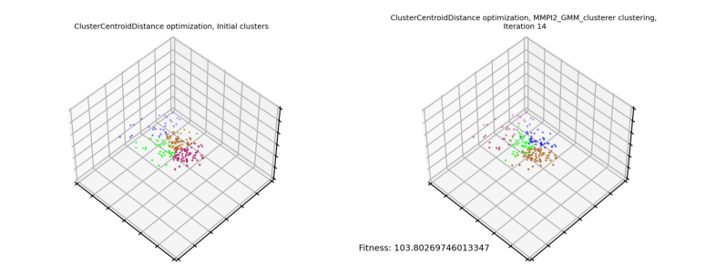

The [MMPI (Minnesota Multiphasic Personality Inventory)](https://en.wikipedia.org/wiki/Minnesota_Multiphasic_Personality_Inventory) is a psychometric test designed to profile personalities through psychological interviews.

A dataset created from this test can be considered as a high-dimensional sample space. This project is aimed at exploring a novel way to cluster samples to determine which personalities are adequate candidates for adoption, (without ground truth classification) by selecting a subset of the psychometric scales (the entries characterizing each sample) that maximizes the separation between clusters.

The approach used in the proposed solution consists in using **Genetic algorithms** to synthesize a binary string acting as a selector for the psychometric scales (each scale is represented by a bit: a *1* determines the usage of that scale while a *0* determines its exclusion from the final solution), by optimize a *custom objective function* (used as a *fitness function* in the evolutionary approach). Various objective functions are used and the result is compared below.

To perform this clustering I will use my [GeneticAlgorithmsLibrary](https://github.com/EmanueleMusumeci/GeneticAlgorithmsLibrary), so I will only specify the additions to this library that are specific to this project.

## Modules

This section integrates the [*Modules*](https://github.com/EmanueleMusumeci/GeneticAlgorithmsLibrary#modules) section of the [GeneticAlgorithmsLibrary](https://github.com/EmanueleMusumeci/GeneticAlgorithmsLibrary). In particular:

- `dataset`: contains the `MMPI2InterviewSample` class, used to represent a single sample in the MMPI-2 dataset, and the `MMPI2Dataset`, used in the clustering problem to hold the dataset, that loads the data from the file MMPI2AdoptionData.csv and allows extracting data in the following modalities:
- *individual scales*: allows selecting (with a binary string) a subset of the psychometric scales and returns for each data point only the selected fields
- *scale groups*: allows selecting whole groups of scales using the taxonomy at this [page](https://en.wikipedia.org/wiki/Minnesota_Multiphasic_Personality_Inventory)
- *couple differences*: the previous two modalities feature an additional modality in which each data point is actually the difference of the psychometric values coming from the same couple

The `MMPI2Dataset` class features in particular the following methods:
    - `load_dataset` that loads the specified CSV file and returns an instance of the dataset corresponding to it
    - various access methods that return data as described above
    

### Use case: *Unsupervised feature selection for clustering*

A possible use case for this library is provided in the `run.py` file.
In this case we're going to try and cluster different profiles for couples that are candidate for adopting children. For this example we're going to try and cluster 4 different profiles (the optimization process is really independent of the number of clusters).

Let's follow the code that runs this example:

1 - First of all we load the dataset
```
    BASE_DIR = os.path.dirname(__file__)
    #print("Base directory: "+BASE_DIR)

    #DATASET_DIR = os.path.join(BASE_DIR,"data")
    SNAPSHOT_DIR = "snapshots"
    
    DATASET_DIR = "data"
    print("Dataset directory: "+DATASET_DIR)

    dataset = MMPI2Dataset.load_dataset(DATASET_DIR, "MMPI2AdoptionData.csv")

```
The loaded dataset will look something like this:
- In 2D:

- In 3D:


2 - Then we instantiate a clustering algorithm. In this case we're going to perform a Spectral clustering, with couple differences computed on individually selected psychometric scales:
```
clusterer = MMPI2_Spectral_clusterer(
        dataset, 
        N_CLUSTERS,
        use_couples = True,
        use_groups=False,
        normalize_data=False
    )
```
3 - Now we instantiate a fitness function (our objective function), that will also use the clusterer instiantiated at the previous step
```
fitness_function = ClusterMinimumPointDistance(
    clusterer
)
```
In this particular case our fitness function maximizes the minimum inter-cluster distance (distance of the nearest points of two different clusters). Maximizing the centroid distance wouldn't make sense as, with non-linear clustering, we might have concentric clusters.

4 - Then we instantiate the visualization method. Also this one needs to use the same clusterer:
```
visualizer_method = Cluster2D3DVisualizer(
    clusterer, 
    show=False, 
    save_snapshot_images_to=SAVE_IMAGES_TO_DIR,
    smaller_scale_range=SMALLER_SCALE_RANGE,
    larger_scale_range=LARGER_SCALE_RANGE
    )
```
The two different scale ranges are used for visualization where a smaller or larger "resolution" is required.

5 - Now we instantiate the optimizer method:
```
    genetic_learner = GeneticBinaryOptimizer(
        BinaryPopulationInitializer(POPULATION_SIZE, STRING_SIZE),
        fitness_function,
        RandomSplit(CROSSOVER_PROBABILITY),
        RandomBitFlip(MUTATION_PROBABILITY),
        early_stopping_criterion=ImprovementHistoryWithPatience(EARLY_STOPPING_PATIENCE),
        #early_stopping_criterion=None,
        result_visualization_method=visualizer_method,
        n_parent_candidates=min(TOURNAMENT_SELECTION_CANDIDATES, POPULATION_SIZE-1),
        checkpoints_dir=SAVE_CHECKPOINTS_TO_DIR
    )
```
6 - Finally we launch the learning process and make sure that visualizations of the progress are generated after the learning has terminated:
```
    genetic_learner.learn(N_ITERATIONS)
    
    genetic_learner.result_visualization.generate_gif()    
    
    genetic_learner.result_visualization.generate_final_comparison()

```
This is the final result of our clustering process:
- The GIF animation of the dimensionally reduced (through PCA) dataset, which was previously projected on the subset of psychometric scales selected throughout the optimization process:
    - In 2D:
    
    - In 3D:
    
- A comparison between the initial clusters (at the beginning of the optimization process) and the clustering obtained at the end of the optimization process:
    - In 2D:
    
    - In 3D:
    
